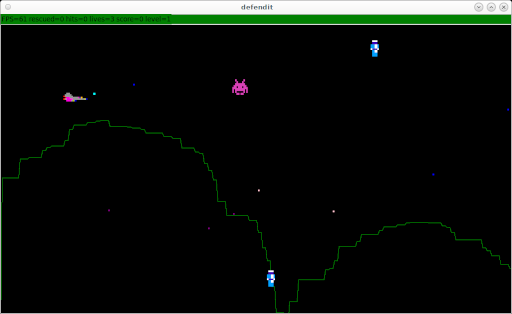

# defendit

A defender style game written in python and tk.



The release version has been packaged with pyinstaller to run standalone

https://github.com/bernardjason/defendit/releases

with linux and windows zip file containing within the dist directory a single executable defendit

## packaged on linux
```
pyinstaller --clean   --add-data "resources/*:." --hidden-import='PIL._tkinter_finder'  -F  defendit.py
cp resources/* dist
```

## packaged pc
```
pyinstaller --clean   --add-data "resources\*;." --hidden-import='PIL._tkinter_finder'  -F  defendit.py
copy resources\* dist
```

